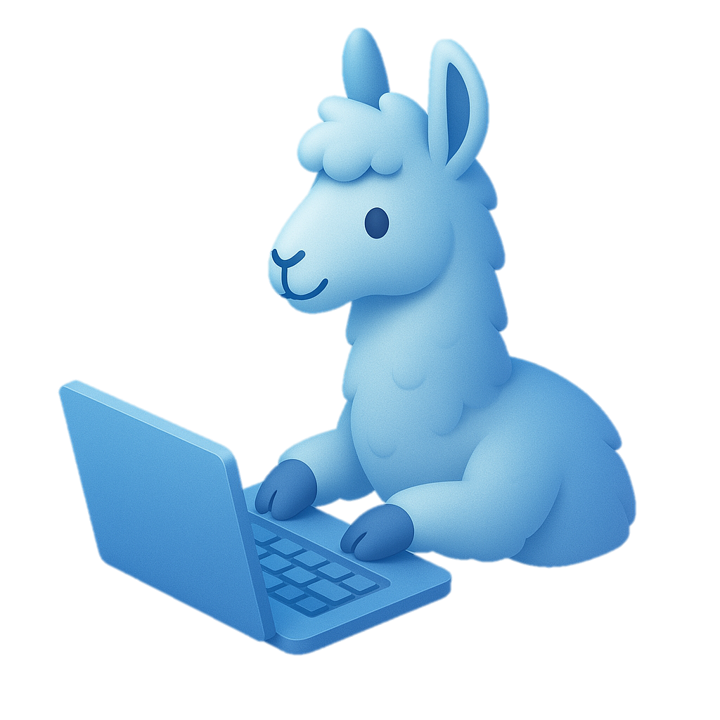
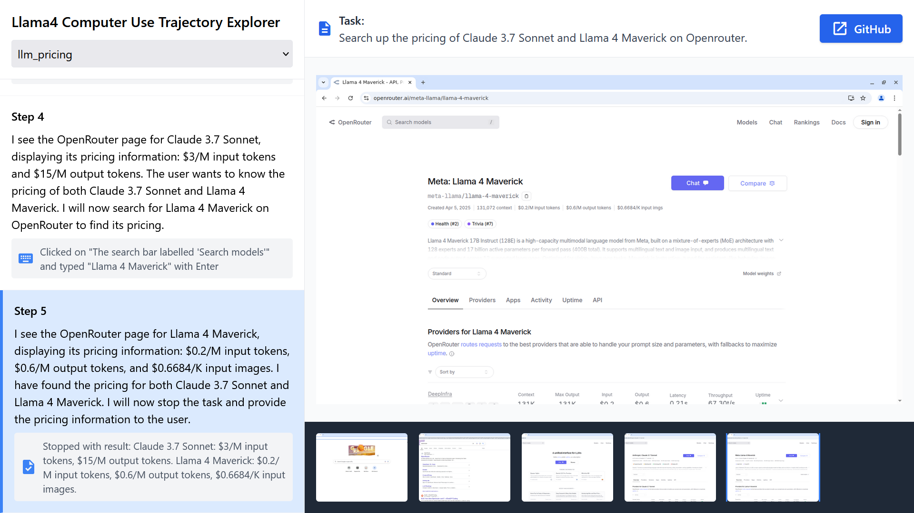
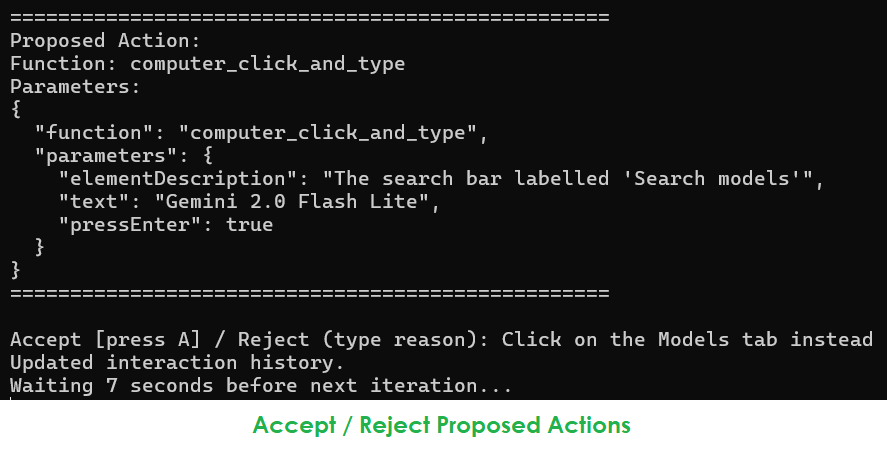

<div align="center">  </div>

<br>

<h1 align="center">
🤑 Llama 4 Affordable Computer Use Agent
</h1>

<div align="center">
<b><i>because computer use doesn't have to be expensive</i></b>
</div>

<br>

# Overview

This is a simple implementation of a computer use agent powered by [**Meta's Llama 4 Maverick**](https://ai.meta.com/blog/llama-4-multimodal-intelligence/) (supports any OpenAI-compatible provider) and [**Bytedance Research's UI-TARS 7B-DPO**](https://github.com/bytedance/UI-TARS). It supports human-in-the-loop operation with acceptance / rejection of actions and user feedback.

It uses Llama 4's vision capabilties to analyse the screenshot and UI-TARS for obtaining UI element coordinates for clicking.

## 📋 Sample Trajectories - https://llama4.pages.dev

Check out sample trajectories in the trajectory explorer at https://llama4.pages.dev!



# Online Demo

(coming soon, star and watch for updates!)

https://forms.gle/rmGEJjYZ8JZX8BN17

^ be the first to be notified when the online demo is ready

# Local Quick Start

**Most importantly, if you try it out, ensure that you are running the agent in an isolated, separate environment like a Docker container or Linux virtual machine.**

1. Ensure your virtual machine or isolated environment has `scrot` and `xdotool`, which the agent uses to get screenshots and execute commands respectively. It also needs `python3` and the Python `requests` library.
   - Usage of `scrot` may mean you need to use Xorg
2. Set your API keys and endpoints in `config.json`, as a template copied from `config-base.json`.
   - Needs a Llama 4 (preferably Maverick, not Scout) API (or any OpenAI compatible provider) and UI-TARS API
   - UI-TARS 7B DPO worked best for me, better than 72B
   - Configure maximum steps too if you wish
3. Boot Google Chrome or Firefox or any other app you want the agent to use
   - Launch the app before running the agent for best results
4. Run `DISPLAY=:0 python3 llama4_agent.py` and try it out!

> ## **Caution:**
>
> The agent currently makes no attempt to prevent you from conducting tasks which may be destructive or impactful (e.g. deleting files or emails). If you use it, you must monitor it closely to prevent it from conducting actions which may be harmful!
> 1. The agent may make mistakes or take unintended actions 
> 2. All suggested actions should be carefully reviewed before execution
> 4. Do not allow access to sensitive data

Refer to documented interaction trajectories to understand its capabilities and shortcomings: https://llama4.pages.dev. **Trajectories are only a rough indicator of the performance, and minor environmental differences and run-to-run-variation may cause hugely differing results.**

(A guide on using Docker to run the agent safely in an isolated environment is coming soon.)

# Features

- use any OpenAI-compatible provider
- full human-in-the-loop operation:
  - accept / reject proposed actions with remarks to guide it
  - defer to user for tasks such as website logins
- runnable with self-hosted models
- saves interaction histories and screenshots for future reference



## 🤑 Affordable
- Llama 4 Maverick can be used for $0.2/million input tokens and $0.6/million output tokens on DeepInfra (as of 7th April 2025)
  - ... or even self-hosted!
- for better capabilities, **vision reasoning models** like OpenAI o4-mini can be used at $0.275 / million input tokens (with caching, which computer use can leverage)
- UI-TARS can be run locally
- it may not have the performance of other computer use agents, but it sure is quite affordable
- opens up computer use to cheaper, smaller models

---


---

# Rationale

Computer use-capable models like Claude 3.7 Sonnet are closed source and costly to use. Promising open models like Bytedance Research's UI-TARS can be less adept at planning and executing a task, but excel at UI grounding - giving coordinates of a UI element from a description.

Therefore, I decided to experiment with combining Llama 4 Maverick's (or even other vision reasoning models like o4-mini's) vision capabilties with UI-TARS 7B-DPO for UI grounding to produce an efficient, **affordable** computer use agent.

# Benchmarks

Not carried out yet. May be coming soon. Check out the trajectories for a rough idea of its capabilities.

## Successful Tasks:
- Browsing the Web Archive
- Comparing LLM pricing
- Interacting with simple web applications
- Interacting with the OS file picker
- Online grammar quiz (26 steps)
- Online shopping (20 steps)

## Unsuccessful Tasks (so far):
- More complicated web applications
- Longer websites (e.g. long pricing pages)
- Navigating LibreOffice Impress (making slideshows)

## Contributing trajectories
We would love to have more successful / unsuccessful trajectories, if you are willing and able to, please share them in a GitHub issue if you would like them featured in the [online trajectory explorer](https://llama4.pages.dev)!

# File Structure

```
llama4_agent.py          <--- main agent and tool implementations
llama4-prompt.txt        <--- contains the main system prompt
llama4-agent-original.js <--- original Node.js version before Python rewrite
prompts/
- (one JSON file for each defined tool)
```

Tool definitions from prompts/ are combined into one blob and substituted into the prompt from llama4-prompt.txt.

# Todo

- Token counting and calculation
- FURTHER efficiency improvements in mind 🤯
- Improvements to accuracy
- Benchmarking
- More trajectories
- More of everything, really
- **Testing with o4-mini**

---

Icon generated by ChatGPT

---

THE SOFTWARE IS PROVIDED “AS IS”, WITHOUT WARRANTY OF ANY KIND, EXPRESS OR IMPLIED, INCLUDING BUT NOT LIMITED TO THE WARRANTIES OF MERCHANTABILITY, FITNESS FOR A PARTICULAR PURPOSE AND NONINFRINGEMENT. IN NO EVENT SHALL THE AUTHORS OR COPYRIGHT HOLDERS BE LIABLE FOR ANY CLAIM, DAMAGES OR OTHER LIABILITY, WHETHER IN AN ACTION OF CONTRACT, TORT OR OTHERWISE, ARISING FROM, OUT OF OR IN CONNECTION WITH THE SOFTWARE OR THE USE OR OTHER DEALINGS IN THE SOFTWARE.
